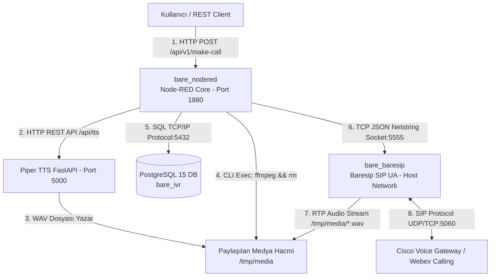

# Node-RED & Baresip IVR Stack (v1.0.0)


Node-RED (IVR Akış Orkestrasyonu, Piper Nöral TTS, FFmpeg), Baresip C-Engine (SIP UA) ve PostgreSQL 15 (Veritabanı) bileşenlerinden oluşan, yüksek performanslı, ölçeklenebilir, **cross-platform (Linux & macOS)** otomatik arama ve IVR platformu.

---

## 📐 Mimari ve Bileşen Şeması

Sistem 3 bağımsız Docker konteynerinden ve dış ağdaki santral/gateway bileşenlerinden oluşur:



---

## ✨ Öne Çıkan Özellikler

- **🛡️ Ön Ses Doğrulama Kalkanı (Audio Verification Guard):** SIP araması yapılmadan önce ses dosyasının varlığı ve boyutu kontrol edilir. Dosya yoksa veya 0 baytsa arama kesinlikle başlatılmaz, karşı taraf boş yere aranmaz.
- **🌐 Baresip Host Network Mode (`network_mode: host`):** Baresip doğrudan host network üzerinde çalışır. SIP `Via:` başlığındaki IP tam eşleşir ve Cisco CUBE / Gateway entegrasyonu sıfır sorunla gerçekleşir.
- **🔊 Dinamik Ses Yönlendirmesi (`/ausrc aufile,<path>`):** Baresip her aramadan önce çalan ses dosyasını dinamik olarak değiştirir. Konfigürasyon değiştirmeye veya Baresip'i yeniden başlatmaya gerek kalmaz.
- **☎️ Display Name Desteği:** `config/baresip/accounts` dosyasındaki `"Gadget_IVR" <sip:6666@192.168.91.122>` tanımı sayesinde karşı tarafın telefon ekranında uygulama ismi gösterilir.
- **🎹 Canlı DTMF Dinleme ve DB Kaydı:** Baresip TCP socket yayını canlı dinlenerek `CALL_DTMF_START` olayı süzülür ve tuşlama verisi zaman damgasıyla PostgreSQL `call_records` tablosuna işlenir.
- **⚡ Dahili Piper Nöral TTS (Eren Sesi):** Nöral Türkçe ses sentezleme modeli (`tr_TR-eren-medium`) ile doğal metinden sese dönüşüm.

---

## 🚀 Hızlı Başlangıç

### 1. Kurulum ve Başlatma
Projeyi kopyalayın ve container'ları başlatın:

```bash
git clone https://github.com/ilkermansur/Node_Red_BareSIP_Stack.git
cd Node_Red_BareSIP_Stack
docker compose up -d --build
```

### 2. Port Matrisi ve Erişim Bilgileri

| Servis Adı | Konteyner İçi Adres | Konteyner Dışı Adres | Açıklama |
| :--- | :--- | :--- | :--- |
| **Node-RED UI** | `http://127.0.0.1:1880` | `http://<SERVER_IP>:1880` | IVR Akış Düzenleyici (Kullanıcı: `admin`, Şifre: `password123`) |
| **Master HTTP API** | `http://127.0.0.1:1880/api/v1/make-call` | `http://<SERVER_IP>:1880/api/v1/make-call` | Dış sistem arama tetikleme API endpoint'i |
| **Piper TTS Daemon** | `http://127.0.0.1:5000/api/tts` | Internal | Nöral Metinden Sese Sentezleme Servisi |
| **Baresip Control** | `baresip:5555` | `localhost:5555` | TCP Netstring Komut Portu |
| **PostgreSQL DB** | `postgres-db:5432` | `localhost:5432` | Veritabanı (`bare_ivr`, kullanıcı: `ivr_user`, şifre: `ivr_password_123`) |

---

## 📡 Master REST API Kullanımı (`POST /api/v1/make-call`)

Dış sistemlerden otomatik IVR araması başlatmak için aşağıdaki HTTP POST isteğini göndermeniz yeterlidir:

```bash
curl -X POST http://<SERVER_IP>:1880/api/v1/make-call \
  -H "Content-Type: application/json" \
  -d '{
    "phone_number": "sip:399@192.168.91.122",
    "text": "Merhaba! Bu bir otomatik IVR bilgilendirme aramasıdır. Lütfen bir tuşa basınız."
  }'
```

---

## 📁 Proje Klasör Yapısı

```text
Node_Red_BareSIP_Stack/
├── build/                 # Custom Dockerfile derleme dosyaları (nodered, baresip)
├── config/                # Merkezi konfigürasyon dosyaları (app_config.json, baresip/config, baresip/accounts)
├── data/
│   ├── nodered/           # Node-RED akışları (flows.json)
│   ├── media/             # Dönüştürülen geçici .wav ses dosyaları
│   ├── piper/             # Piper ONNX ses modelleri
│   └── postgres/          # PostgreSQL kalıcı veritabanı dosyaları
├── docker-compose.yml     # 3-Container Docker Orkestrasyonu
└── README.md              # Proje Ana Dokümantasyonu
```

---

## 🏷️ Sürüm Yönetimi ve Tagging

Bu proje Semantic Versioning standartlarına uygun olarak versiyonlanmaktadır.

- **`v1.0.0` (Mühürlü Ana Sürüm):** Projenin tüm bileşenleriyle çalışan, test edilmiş ilk ana sürümdür.
- Herhangi bir anda `v1.0.0` durumuna geri dönmek için:
  ```bash
  git checkout v1.0.0
  ```

---

## 📄 Lisans

Bu proje MIT Lisansı ile lisanslanmıştır.
