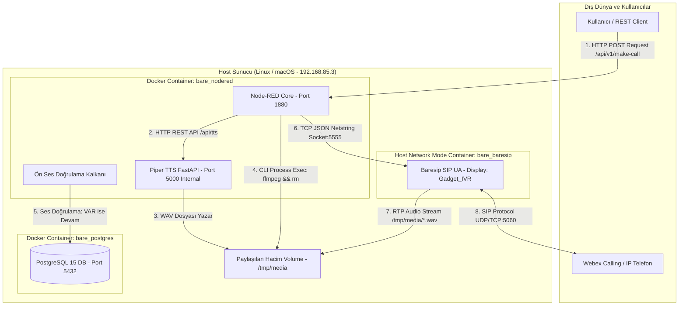

# Node-RED & Baresip IVR Stack: Mimari Analiz ve Sistem Röntgeni (v1.0.0 Sealed Release)

Bu doküman; platformun tüm bileşenlerini, bileşenlerin birbirleriyle olan iletişim protokollerini (API, TCP Socket, SQL, CLI), konteyner içi ve dışı ağ yapılarını, akışların (flow) arka planda nasıl çalıştığını ve geliştiricilerin sadece Node-RED flow'ları ile sistemi nasıl genişletebileceğini **en genel seviyeden en derin teknik detaylara (deep-dive)** kadar açıklamaktadır.

---

## 1. 🏗️ Yapı Nelerden Oluşuyor? (Genel Bakış)

Sistem; 3 bağımsız Docker konteyneri ve dış ağlarda yer alan santral/gateway bileşenlerinden oluşan, **IP-bağımsız (stateless)**, yüksek performanslı bir IVR mimarisidir.

### Ana Bileşen Listesi ve İmaj Rolleri:

| Bileşen Adı | Docker Container Name | Taban İmaj & Teknolojiler | Sorumluluk ve Rolü |
| :--- | :--- | :--- | :--- |
| **Node-RED & Audio Engine** | `bare_nodered` | `python:3.10-slim` (Debian) Node.js 20, Python 3.10, FFmpeg 7.x | IVR Akış Orkestrasyonu, Piper TTS REST Server (Port 5000), FFmpeg Ses Dönüştürme, Ön Ses Doğrulama Kalkanı, DB Entegrasyonu. |
| **SIP Motoru (Baresip)** | `bare_baresip` | Debian Bookworm Baresip v1.0.0 C-Engine | SIP Çağrı Yönetimi, RTP Ses Yayınlama (`aufile`), DTMF Tuşlama Algılama, Cisco Gateway İletişimi. (`network_mode: host`) |
| **Veritabanı (PostgreSQL)** | `bare_postgres` | `postgres:15-alpine` | Arama Kuyruğu (`call_queue`), CDR Arama Kayıtları (`call_records`), Kullanıcı / Menü Verileri. |
| **Cisco Voice Gateway / PBX** | *Remote Equipment* | Cisco IOS CUBE / Webex Calling | IP Trunk üzerinden SIP INVITE paketlerini kabul eder ve Webex Calling / PSTN hattına yönlendirir. |

---

## 2. 🔌 Bileşenler Birbiriyle Nasıl Konuşuyor? (İletişim Röntgeni)

---

## 3. 🛡️ Güvenlik Kalkanı & Görünen İsim Yapılandırması

### A. Ön Ses Doğrulama Kalkanı (Audio Verification Guard)
Arama yapmadan önce ses dosyasının diskte varlığı (`os.path.exists`) ve geçerli boyutta olduğu (`os.path.getsize > 100`) kontrol edilir. Ses dosyası oluşturulamamışsa arama **derhal iptal edilir**, Baresip'e paket atılmaz ve veritabanına `FAILED_AUDIO_MISSING` yazılır.

### B. SIP Görünen Adı (Display Name)
`config/baresip/accounts` içinde:
`"Gadget_IVR" <sip:6666@192.168.91.122>;regint=0;audio_codecs=PCMA,PCMU`
tanımı kullanılarak santral dahili numarası (`6666`) korunur ve aranan kişinin ekranda **"Gadget_IVR"** görmesi sağlanır.
