# Node-RED IVR Akışları (Flows) ve Düğüm (Node) Geliştirme Rehberi

Bu doküman; platform içerisinde yer alan **4 temel Node-RED akışını (Flow 1, Flow 2, Flow 3 ve Master Tutorial Flow)**, bu akışlardaki her bir düğümün (node) **girdi (In)**, **iç işlem (Internal Code/Logic)** ve **çıktı (Out)** detaylarını, **Ön Ses Doğrulama Kalkanı** ile **Display NameSIP ayarlarını** açıklamaktadır.

---

## 1. 🗺️ Akışlar Genel Mimari Şeması

```mermaid
graph TD
    subgraph Flow1["Akış 1: Metni Medyaya Çevir (TTS Test)"]
        F1_Inj[Inject Node] -->|JSON text| F1_Piper[HTTP Request: Piper TTS API]
        F1_Piper -->|WAV Path| F1_Dbg[Debug Node]
    end

    subgraph Flow2["Akış 2: TTS + FFmpeg Telekom Formatlama"]
        F2_Inj[Inject Node] -->|JSON text| F2_Piper[HTTP Request: Piper TTS API]
        F2_Piper -->|Raw WAV| F2_PyCmd[Python: FFmpeg Komut Üret]
        F2_PyCmd -->|CLI string| F2_Exec[Exec Node: FFmpeg 8kHz]
        F2_Exec -->|8kHz Telecom WAV| F2_Dbg[Debug Node]
    end

    subgraph Flow3["Akış 3: TTS + FFmpeg + Baresip IVR Arama"]
        F3_Inj[Inject Node] -->|Phone + Text| F3_Piper[Piper TTS API]
        F3_Piper -->|Raw WAV| F3_Exec[Exec Node: FFmpeg 8kHz]
        F3_Exec -->|Telecom WAV| F3_PyGuard{Python: Ses Dosyası Var Mı?}
        F3_PyGuard -->|YOK: İptal Et| F3_Err[Node Error: Arama İptal]
        F3_PyGuard -->|VAR: Netstring| F3_PyDial[Python: Netstring Formatter]
        F3_PyDial -->|TCP Netstring| F3_Baresip[TCP Request: Baresip 5555]
        
        F3_TCPIn[TCP In: Baresip Stream] -->|Raw Events| F3_PyDTMF[Python: DTMF Parser]
        F3_PyDTMF -->|Key Pressed| F3_Dbg[Debug Node]
    end

    subgraph MasterFlow["Tutorial & Master IVR Pipeline (Tümleşik REST API)"]
        M_HTTP[HTTP In: POST /api/v1/make-call] --> M_Prep[Python: Parametre Hazırla]
        M_Prep --> M_Piper[HTTP Request: Piper TTS]
        M_Piper --> M_FFmpegCmd[Python: FFmpeg Komut Üret]
        M_FFmpegCmd --> M_FFmpegExec[Exec Node: FFmpeg 8kHz & Auto Cleanup]
        M_FFmpegExec --> M_Guard{Python: Ses Var Mı?}
        M_Guard -->|YOK| M_ErrDB[DB: FAILED_AUDIO_MISSING]
        M_Guard -->|VAR| M_DBDial[Python: PostgreSQL Insert & Netstring Dial]
        M_DBDial --> M_Baresip[TCP Request: Baresip 5555]
        M_Baresip --> M_HTTPResp[HTTP Response 200 OK]

        M_TCPIn[TCP In: Baresip Stream] --> M_DTMFDB[Python: DTMF Parser & DB Update]
        M_Cron[Inject Timer 60s] --> M_Clean[Python: Media Garbage Collector]
    end
```



---

## 2. 🛡️ Ön Ses Doğrulama Kalkanı (Audio Verification Guard)

Arama öncesinde ses dosyasının diskte yer almaması veya 0 bayt olması durumunda karşı tarafın boş yere aranmasını önleyen güvenlik mekanizmasıdır.

### Python Düğümündeki Koruma Kodu:
```python
import os, json

target = msg.get('target_phone', 'sip:399@192.168.91.122')
audio_path = msg.get('formatted_audio', '/tmp/media/flow3_telecom.wav')

# 🛑 GÜVENLİK KONTROLÜ: Ses dosyası diskte var mı ve 100 bayttan büyük mü?
if not os.path.exists(audio_path) or os.path.getsize(audio_path) < 100:
    err_msg = f"HATA: Ses dosyası ({audio_path}) diskte bulunamadı veya 0 bayt! Karşı tarafı rahatsız etmemek için SIP araması İPTAL EDİLDİ."
    node.error(err_msg) # Node-RED kırmızı hata konsoluna basar
    msg['payload'] = {"status": "ERROR", "error": err_msg}
    return None # Flow burada durdurulur, Baresip'e paket GÖNDERİLMEZ!
```

---

## 3. ☎️ SIP Account & Görünen İsim (Display Name) Konfigürasyonu

SIP paketindeki `From` başlığında arayan numara yerine şirket/uygulama adının görünmesi için `config/baresip/accounts` dosyasında uygulanan standart format:

```text
"Gadget_IVR" <sip:6666@192.168.91.122>;regint=0;audio_codecs=PCMA,PCMU
```

- **`"Gadget_IVR"` (Display Name):** Hedef telefon ekranında görünen metindir.
- **`6666` (Extension ID):** Santralin tanıdığı dahili numaradır.

---

## 4. 📘 Akış 1: Metni Medyaya Çevir (Piper TTS Test)

**Amacı:** Kullanıcıdan gelen metni yerel Piper Nöral TTS servisine ileterek yüksek kaliteli 22050Hz WAV ses dosyasına dönüştürmek.

### Düğüm (Node) Detayları:

#### 1.1. `1. Tetikle (TTS Test)` (Inject Node)
- **Tür (Type):** `inject`
- **Girdi (In):** Manuel Buton Tetikleme.
- **Çıktı (Out - `msg.payload`):**
  ```json
  {
    "text": "Merhaba! Bu bir ses sentezleme ve tonlama testidir...",
    "model": "tr_TR-eren-medium",
    "filename": "flow1_test.wav"
  }
  ```

#### 1.2. `Piper TTS API` (HTTP Request Node)
- **Tür (Type):** `http request` (POST `http://127.0.0.1:5000/api/tts`)
- **Girdi (In):** `msg.payload`
- **Çıktı (Out - `msg.payload`):**
  ```json
  {
    "status": "success",
    "file_path": "/tmp/media/flow1_test.wav",
    "duration_seconds": 12.4
  }
  ```

---

## 5. 📙 Akış 3: TTS + FFmpeg + Baresip IVR Arama & Canlı DTMF Dinleme

### Düğüm (Node) Detayları:

#### 3.1. `Baresip /dial Komutunu Oluştur` (Python Function Node)
- **Girdi (In):** `msg.formatted_audio`, `msg.target_phone`
- **İçerideki Kod:**
  ```python
  import os, json

  target = msg.get('target_phone', 'sip:399@192.168.91.122')
  audio_path = msg.get('formatted_audio', '/tmp/media/flow3_telecom.wav')

  # Güvenlik Kontrolü
  if not os.path.exists(audio_path) or os.path.getsize(audio_path) < 100:
      node.error(f"Ses dosyası ({audio_path}) yok! Arama İPTAL EDİLDİ.")
      return None

  # Çifte Netstring Komutu: ausrc + dial
  cmd_ausrc = {'command': 'ausrc', 'params': f'aufile,{audio_path}', 'token': 'flow3_ausrc'}
  cmd_dial = {'command': 'dial', 'params': target, 'token': 'flow3_dial'}
  
  msg['payload'] = f"{len(json.dumps(cmd_ausrc))}:{json.dumps(cmd_ausrc)},{len(json.dumps(cmd_dial))}:{json.dumps(cmd_dial)},"
  return msg
  ```
- **Çıktı (Out):** Çifte Netstring arama paketi.

#### 3.2. `DTMF Parser` (Python Function Node)
- **Girdi (In):** Baresip TCP yayın akışı.
- **İçerideki Kod:**
  ```python
  import json
  raw = str(msg.get('payload', '')).strip()
  if ':' in raw and raw.endswith(','):
      raw = raw.split(':', 1)[1].rstrip(',')
  try:
      event = json.loads(raw)
      # Sadece tuşa basıldığı andaki (CALL_DTMF_START) olayı al
      if event.get('event') and event.get('type') == 'CALL_DTMF_START' and event.get('param') != '':
          msg['payload'] = {"status": "DTMF_RECEIVED", "key": event.get('param')}
          return msg
  except Exception:
      pass
  return None
  ```
- **Çıktı (Out):** `{"status": "DTMF_RECEIVED", "key": "1"}`

---

## 6. 📕 Master / Tutorial Flow: Tümleşik Pipeline & REST API

### Endpoint Kullanımı:
- **URL:** `POST http://192.168.85.3:1880/api/v1/make-call`
- **Body:**
  ```json
  {
    "phone_number": "sip:399@192.168.91.122",
    "text": "Merhaba! Lütfen bir tuşa basınız."
  }
  ```

#### 5.4. `5. DB Kaydı Başlat & Baresip Dial` (Python Function Node)
- **İçerideki Kod:**
  ```python
  import os, json, psycopg2

  call_id = msg.get('call_id', 'call_000')
  phone = msg.get('phone_number', 'sip:399@192.168.91.122')
  audio_path = msg.get('formatted_audio', '/tmp/media/flow3_telecom.wav')

  # Güvenlik Kontrolü: Ses dosyası yoksa aramayı iptal et ve FAILED yaz
  if not os.path.exists(audio_path) or os.path.getsize(audio_path) < 100:
      node.error("Ses dosyası yok! Arama İPTAL EDİLDİ.")
      try:
          conn = psycopg2.connect(host='postgres-db', dbname='bare_ivr', user='ivr_user', password='ivr_password_123')
          cur = conn.cursor()
          cur.execute("INSERT INTO call_records (call_id, phone_number, status) VALUES (%s, %s, %s)", (call_id, phone, 'FAILED_AUDIO_MISSING'))
          conn.commit()
          conn.close()
      except Exception:
          pass
      return None

  # DB Insert & Baresip Netstring
  cmd_ausrc = {'command': 'ausrc', 'params': f'aufile,{audio_path}', 'token': f'{call_id}_ausrc'}
  cmd_dial = {'command': 'dial', 'params': phone, 'token': call_id}
  msg['payload'] = f"{len(json.dumps(cmd_ausrc))}:{json.dumps(cmd_ausrc)},{len(json.dumps(cmd_dial))}:{json.dumps(cmd_dial)},"
  return msg
  ```
