# Node-RED IVR Akışları (Flows) ve Düğüm (Node) Geliştirme Rehberi

Bu doküman; platform içerisinde yer alan **4 temel Node-RED akışını (Flow 1, Flow 2, Flow 3 ve Master Tutorial Flow)**, bu akışlardaki her bir düğümün (node) **girdi (In)**, **iç işlem (Internal Code/Logic)** ve **çıktı (Out)** detaylarını ve yeni bir IVR akışının sıfırdan nasıl geliştirebileceğini adım adım açıklamaktadır.

---

## 1. 🗺️ Akışlar Genel Mimari Şeması

```mermaid
graph TD
    subgraph Flow1["Akış 1: Metni Medyaya Çevir (TTS Test)"]
        F1_Inj[Inject Node] -->|JSON text| F1_Piper[HTTP Request: Piper TTS API]
        F1_Piper -->|WAV Path| F1_Dbg[Debug Node]
    end

    subgraph Flow2["Akış 2: TTS + FFmpeg Telekom Formatlama"]
        F2_Inj[Inject Node] -->|JSON text| F2_Piper[HTTP Request: Piper TTS API]
        F2_Piper -->|Raw WAV| F2_PyCmd[Python: FFmpeg Komut Üret]
        F2_PyCmd -->|CLI string| F2_Exec[Exec Node: FFmpeg 8kHz]
        F2_Exec -->|8kHz Telecom WAV| F2_Dbg[Debug Node]
    end

    subgraph Flow3["Akış 3: TTS + FFmpeg + Baresip IVR Arama"]
        F3_Inj[Inject Node] -->|Phone + Text| F3_Piper[Piper TTS API]
        F3_Piper -->|Raw WAV| F3_Exec[Exec Node: FFmpeg 8kHz]
        F3_Exec -->|Telecom WAV| F3_PyDial[Python: Netstring Formatter]
        F3_PyDial -->|TCP Netstring| F3_Baresip[TCP Request: Baresip 5555]
        
        F3_TCPIn[TCP In: Baresip Stream] -->|Raw Events| F3_PyDTMF[Python: DTMF Parser]
        F3_PyDTMF -->|Key Pressed| F3_Dbg[Debug Node]
    end

    subgraph MasterFlow["Tutorial & Master IVR Pipeline (Tümleşik REST API)"]
        M_HTTP[HTTP In: POST /api/v1/make-call] --> M_Prep[Python: Parametre Hazırla]
        M_Prep --> M_Piper[HTTP Request: Piper TTS]
        M_Piper --> M_FFmpegCmd[Python: FFmpeg Komut Üret]
        M_FFmpegCmd --> M_FFmpegExec[Exec Node: FFmpeg 8kHz & Auto Cleanup]
        M_FFmpegExec --> M_DBDial[Python: PostgreSQL Insert & Netstring Dial]
        M_DBDial --> M_Baresip[TCP Request: Baresip 5555]
        M_Baresip --> M_HTTPResp[HTTP Response 200 OK]

        M_TCPIn[TCP In: Baresip Stream] --> M_DTMFDB[Python: DTMF Parser & DB Update]
        M_Cron[Inject Timer 60s] --> M_Clean[Python: Media Garbage Collector]
    end
```



---

## 2. 📘 Akış 1: Metni Medyaya Çevir (Piper TTS Test)

**Amacı:** Kullanıcıdan gelen metni yerel Piper Nöral TTS servisine ileterek yüksek kaliteli 22050Hz WAV ses dosyasına dönüştürmek.

### Düğüm (Node) Detayları:

#### 1.1. `1. Tetikle (TTS Test)` (Inject Node)
- **Tür (Type):** `inject`
- **Girdi (In):** Manuel Buton Tetikleme.
- **İçerideki İşlem:** Aşağıdaki JSON verisini hazırlar.
- **Çıktı (Out - `msg.payload`):**
  ```json
  {
    "text": "Merhaba! Bu bir ses sentezleme ve tonlama testidir...",
    "model": "tr_TR-eren-medium",
    "filename": "flow1_test.wav"
  }
  ```

#### 1.2. `Piper TTS API` (HTTP Request Node)
- **Tür (Type):** `http request` (POST `http://127.0.0.1:5000/api/tts`)
- **Girdi (In):** `msg.payload` (Sentezlenecek metin ve model bilgisi)
- **İçerideki İşlem:** Konteyner içindeki Piper FastAPI servisine HTTP POST atar. FastAPI servisi sesi sentezleyip `/tmp/media/flow1_test.wav` dosyasına yazar.
- **Çıktı (Out - `msg.payload`):**
  ```json
  {
    "status": "success",
    "file_path": "/tmp/media/flow1_test.wav",
    "filename": "flow1_test.wav",
    "duration_seconds": 12.4
  }
  ```

#### 1.3. `Flow 1 Sonuç` (Debug Node)
- **Tür (Type):** `debug`
- **Girdi (In):** `msg.payload`
- **Çıktı (Out):** Debug sekmesine JSON sonucunu basar.

---

## 3. 📗 Akış 2: TTS + FFmpeg Telekom Formatlama

**Amacı:** Piper tarafından üretilen 22050Hz ses dosyasını telekom/SIP altyapılarıyla uyumlu **8000Hz, Mono, 16-bit PCM (`pcm_s16le`)** formatına dönüştürmek.

### Düğüm (Node) Detayları:

#### 2.1. `FFmpeg Komutunu Üret` (Python Function Node)
- **Tür (Type):** `python-function`
- **Girdi (In - `msg.payload`):** Piper TTS çıktısı (`file_path`).
- **İçerideki Kod:**
  ```python
  file_info = msg.get('payload', {})
  input_path = file_info.get('file_path', '/tmp/media/flow2_raw.wav')
  output_path = input_path.replace('_raw.wav', '_telecom.wav')

  msg['formatted_audio'] = output_path
  # FFmpeg komutunu oluşturur
  msg['payload'] = f"ffmpeg -y -i {input_path} -ar 8000 -ac 1 -c:a pcm_s16le {output_path}"
  return msg
  ```
- **Çıktı (Out):**
  - `msg.formatted_audio`: `/tmp/media/flow2_telecom.wav`
  - `msg.payload`: `"ffmpeg -y -i /tmp/media/flow2_raw.wav -ar 8000 -ac 1 -c:a pcm_s16le /tmp/media/flow2_telecom.wav"`

#### 2.2. `FFmpeg 8kHz Converter` (Exec Node)
- **Tür (Type):** `exec`
- **Girdi (In - `msg.payload`):** FFmpeg CLI komut dizesi.
- **İçerideki İşlem:** İşletim sisteminde FFmpeg sürecini çalıştırır. (Not: Yalnızca 1. bacak `stdout` bağlıdır).
- **Çıktı (Out):** FFmpeg stdout çıktısı.

---

## 4. 📙 Akış 3: TTS + FFmpeg + Baresip IVR Arama & Canlı DTMF Dinleme

**Amacı:** Sesi ürettikten ve formatladıktan sonra Baresip üzerinden hedef SIP abonesini aramak ve telefon açıldığında kullanıcının bastığı tuşları (DTMF) canlı olarak dinlemek.

### Düğüm (Node) Detayları:

#### 3.1. `Baresip /dial Komutunu Oluştur` (Python Function Node)
- **Tür (Type):** `python-function`
- **Girdi (In):** `msg.phone_number` (`"sip:399@192.168.91.122"`)
- **İçerideki Kod:**
  ```python
  import json
  phone_no = msg.get('phone_number', 'sip:399@192.168.91.122')
  
  # Baresip v1.0.0 JSON Netstring formatı
  cmd_obj = {"command": "dial", "params": phone_no, "token": "flow3_dial"}
  cmd_str = json.dumps(cmd_obj)
  
  # <length>:{"command":"..."},
  msg['payload'] = f"{len(cmd_str)}:{cmd_str},"
  return msg
  ```
- **Çıktı (Out - `msg.payload`):** `"59:{\"command\": \"dial\", \"params\": \"sip:399@192.168.91.122\", \"token\": \"flow3_dial\"},"`

#### 3.2. `Baresip ctrl_tcp (5555)` (TCP Request Node)
- **Tür (Type):** `tcp request` (`server: baresip`, `port: 5555`)
- **Girdi (In):** Netstring formatlı arama emri.
- **İçerideki İşlem:** Baresip TCP socketine bağlanır, komutu iletir.
- **Çıktı (Out):** Baresip'in döndürdüğü yanıt dizesi.

#### 3.3. `Baresip Canlı Dinleyici (5555)` (TCP In Node)
- **Tür (Type):** `tcp in` (`host: baresip`, `port: 5555`, `stream utf8`)
- **Girdi (In):** Baresip SIP UA tarafından yayınlanan canlı TCP olay akışı.
- **Çıktı (Out - `msg.payload`):** Ham Netstring olay metni.

#### 3.4. `DTMF Parser` (Python Function Node)
- **Tür (Type):** `python-function`
- **Girdi (In):** Baresip TCP yayın akışı.
- **İçerideki Kod:**
  ```python
  import json

  raw_payload = msg.get('payload', '')
  if isinstance(raw_payload, bytes):
      raw_payload = raw_payload.decode('utf-8', errors='ignore')

  raw_str = str(raw_payload).strip()
  if ':' in raw_str and raw_str.endswith(','):
      try:
          raw_str = raw_str.split(':', 1)[1].rstrip(',')
      except Exception:
          pass

  try:
      event = json.loads(raw_str)
      event_type = str(event.get('type', ''))
      key = str(event.get('param', '')).strip()

      # SADECE Tuşa Basıldığı Anki (CALL_DTMF_START) Olayını Süz:
      if event.get('event') and event_type == 'CALL_DTMF_START' and key != '':
          msg['payload'] = {
              "status": "DTMF_RECEIVED",
              "key": key,
              "event_type": event_type
          }
          return msg
  except Exception:
      pass

  return None
  ```
- **Çıktı (Out):** `{"status": "DTMF_RECEIVED", "key": "1"}`

---

## 5. 📕 Master / Tutorial Flow: Tümleşik Pipeline & REST API

**Amacı:** Dış sistemlerin `POST /api/v1/make-call` ile istek atabildiği, sesi anında sentezleyip formatlayan, arayan, veritabanına yazan ve tuşlamayı DB'ye kaydeden **full-stack IVR pipeline'ı**.

### Endpoint Kullanımı:
- **URL:** `POST http://192.168.85.3:1880/api/v1/make-call`
- **Body:**
  ```json
  {
    "phone_number": "sip:399@192.168.91.122",
    "text": "Merhaba! Lütfen bir tuşa basınız."
  }
  ```

### Düğüm (Node) Detayları:

#### 5.1. `POST /api/v1/make-call` (HTTP In Node)
- **Girdi (In):** HTTP POST İsteği.
- **Çıktı (Out):** `msg.payload` JSON body.

#### 5.2. `1. Parametre & Dosya Adı Hazırla` (Python Function Node)
- **İçerideki Kod:**
  ```python
  import time
  body = msg.get('payload', {})
  phone = body.get('phone_number', 'sip:399@192.168.91.122')
  text = body.get('text', 'Merhaba! Lütfen bir tuşa basınız.')
  
  call_id = f"call_{int(time.time())}"
  raw_file = f"{call_id}_raw.wav"

  msg['call_id'] = call_id
  msg['phone_number'] = phone
  msg['tts_text'] = text
  msg['payload'] = {
      "text": text,
      "model": "tr_TR-eren-medium",
      "filename": raw_file
  }
  return msg
  ```

#### 5.3. `3. FFmpeg Komutunu Üret & Auto Cleanup` (Python Function Node)
- **İçerideki Kod:**
  ```python
  file_info = msg.get('payload', {})
  input_path = file_info.get('file_path', '/tmp/media/master_raw.wav')
  output_path = input_path.replace('_raw.wav', '_telecom.wav')

  msg['formatted_audio'] = output_path
  # Dönüştürme bitince ham dosyayı anında siler (&& rm -f input_path)
  msg['payload'] = f"ffmpeg -y -i {input_path} -ar 8000 -ac 1 -c:a pcm_s16le {output_path} && rm -f {input_path}"
  return msg
  ```

#### 5.4. `5. DB Kaydı Başlat & Baresip Dial` (Python Function Node)
- **İçerideki Kod:**
  ```python
  import json, psycopg2

  call_id = msg.get('call_id', 'call_000')
  phone = msg.get('phone_number', 'sip:399@192.168.91.122')

  # 1. PostgreSQL DB'ye Arama Kaydı Ekler
  try:
      conn = psycopg2.connect(host='postgres-db', dbname='bare_ivr', user='ivr_user', password='ivr_password_123')
      cur = conn.cursor()
      cur.execute("INSERT INTO call_records (call_id, phone_number, direction, status, started_at) VALUES (%s, %s, %s, %s, CURRENT_TIMESTAMP)", (call_id, phone, 'OUTBOUND', 'IN_PROGRESS'))
      conn.commit()
      cur.close()
      conn.close()
  except Exception:
      pass

  # 2. Baresip Netstring Dial Komutu
  cmd_obj = {'command': 'dial', 'params': phone, 'token': call_id}
  cmd_str = json.dumps(cmd_obj)
  msg['payload'] = f"{len(cmd_str)}:{cmd_str},"
  return msg
  ```

#### 5.5. `DTMF Parse & DB Kaydet` (Python Function Node)
- **İçerideki Kod:**
  ```python
  import json, psycopg2

  raw_payload = msg.get('payload', '')
  if isinstance(raw_payload, bytes):
      raw_payload = raw_payload.decode('utf-8', errors='ignore')

  raw_str = str(raw_payload).strip()
  if ':' in raw_str and raw_str.endswith(','):
      try:
          raw_str = raw_str.split(':', 1)[1].rstrip(',')
      except Exception:
          pass

  try:
      event = json.loads(raw_str)
      event_type = str(event.get('type', ''))
      key = str(event.get('param', '')).strip()

      if event.get('event') and event_type == 'CALL_DTMF_START' and key != '':
          # Tuşlamayı Zaman Damgasıyla DB'ye Yazar
          try:
              conn = psycopg2.connect(host='postgres-db', dbname='bare_ivr', user='ivr_user', password='ivr_password_123')
              cur = conn.cursor()
              cur.execute("UPDATE call_records SET dtmf_digits = %s, status = %s, ended_at = CURRENT_TIMESTAMP WHERE id = (SELECT max(id) FROM call_records);", (key, 'COMPLETED'))
              conn.commit()
              cur.close()
              conn.close()
          except Exception:
              pass

          msg['payload'] = {
              "status": "DTMF_SAVED_TO_DB",
              "key": key,
              "event_type": event_type
          }
          return msg
  except Exception:
      pass

  return None
  ```

---

## 6. 🛠️ Yeni Bir Flow Nasıl Geliştirilir? (Adım Adım)

1. Node-RED paneline yeni bir sekme ekleyin (**`+`** butonu).
2. Bir tetikleyici koyun (**`Inject`** veya **`HTTP In`**).
3. Metni sese çevirmek için **`HTTP Request`** düğümünü `http://127.0.0.1:5000/api/tts` adresine yönlendirin.
4. Dönüştürme için **`Exec`** düğümüne FFmpeg komutu verin.
5. Veritabanı işlemleri için **`Python Function`** düğümünde `psycopg2.connect(host='postgres-db', ...)` kullanın.
6. Arama başlatmak için **`TCP Request`** düğümünü `baresip:5555` portuna Netstring formatında bağlayın.
