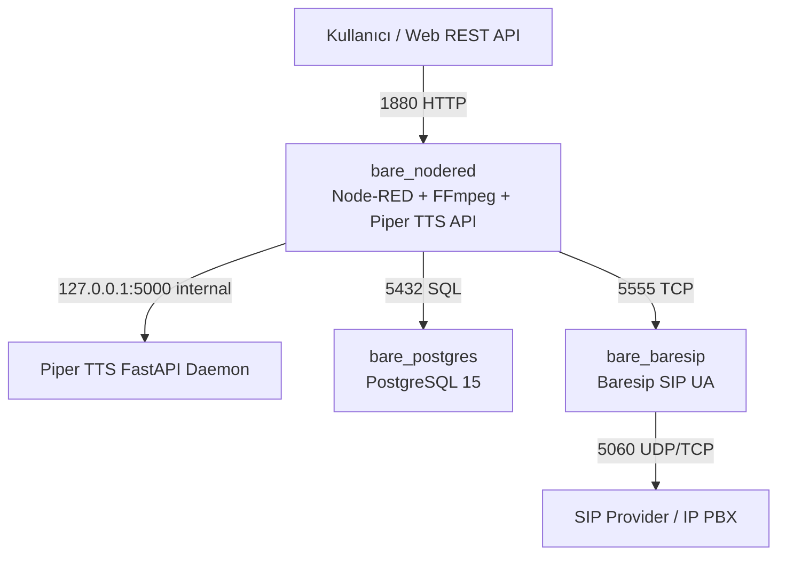

# Node-RED & Baresip IVR Stack: Mimari, Deneyimler ve Teknik Özet

Bu doküman; **Node-RED**, **Piper TTS (Nöral Ses Sentezleme)**, **FFmpeg (Telekom Ses Formatlama)**, **Baresip (SIP Engine)** ve **PostgreSQL** bileşenlerini içeren cross-platform IVR platformunun geliştirilme sürecini, mimari kararlarını ve edinilen tüm rafine teknik tecrübeleri içermektedir.

---

## 1. 📌 Proje Amacı ve Genel Bakış

Projenin temel amacı; yüksek performanslı, ölçeklenebilir ve **saf Python (Python 3)** mantığıyla orkestre edilen otomatik arama ve IVR (Interactive Voice Response) sistemi oluşturmaktır.

### Temel Yetenekler:
1. **Nöral TTS (Piper):** Türkçe (**Eren** - `tr_TR-eren-medium`) ve İngilizce (**Amy** - `en_US-amy-medium`) ses modelleri ile yüksek kaliteli metinden sese dönüştürme.
2. **Telekom Ses Formatlama (FFmpeg):** Piper çıktısı olan 22050Hz seslerin telekom/SIP hatlarıyla %100 uyumlu **8000Hz, Mono, 16-bit PCM (`pcm_s16le`)** formatına dönüştürülmesi.
3. **SIP Arama Engine (Baresip):** `ctrl_tcp` (Port 5555) üzerinden komuta edilen, numara arama, ses yayınlama ve DTMF (tuşlama) algılama altyapısı.
4. **Saf Python Orkestrasyonu (Node-RED):** Düğümler arasında JavaScript yerine `node-red-contrib-python-function` kullanılarak tamamen Python sözdizimi ile veri işleme.

---

## 2. 🏗️ Mimari Evrim ve Alınan Kararlar

### İlk Durum (4 Konteynerli Mimari):
- Node-RED, Baresip, PostgreSQL ve Piper TTS ayrı 4 container olarak kurgulanmıştı.
- **Karşılaşılan Sorunlar:**
  - Konteynerler arası ağ gecikmesi.
  - Piper TTS için varsayılan Alpine Linux tabanlı imajlarda `piper-phonemize` ve `onnxruntime` kütüphanelerinin C-extension binary tekerleklerinin (`musl` libc uyumsuzluğu nedeniyle) source'tan derlenmeye çalışılması ve derleme sürelerinin aşırı uzaması.

### Nihai Durum (3 Konteynerli Tekilleştirilmiş Mimari):
Kaynak kullanımını düşürmek ve derleme süreçlerini hızlandırmak amacıyla sistem **3 bağımsız konteynere** indirgenmiştir:

1. **`bare_nodered` (Birleşik Node-RED & TTS & FFmpeg):**
   - **Base Image:** `python:3.10-slim` (Debian Bookworm)
   - Node-RED (Port: `1880`) + Piper TTS FastAPI Daemon (Port: `5000` internal, `5005` external) + FFmpeg 7.x.
2. **`bare_baresip` (SIP Motoru):**
   - Debian Bookworm tabanlı Baresip SIP UA (Port: `5060` UDP/TCP, Control: `5555` TCP).
3. **`bare_postgres` (Veritabanı):**
   - PostgreSQL 15 Alpine (Port: `5432`, `init.sql` ile otomatik şema kurulumu).

---

## 3. 💡 Edinilen Kritik Teknik Deneyimler & "Gotchas"

### 1. `python:3.10-slim` (Debian/glibc) vs Alpine (`musl`) Seçimi
- **Deneyim:** C/C++ bağımlılığı olan Python paketleri (`onnxruntime`, `piper-phonemize`, `pydantic-core`) Alpine Linux (`musl` libc) üzerinde `manylinux` wheel paketlerini kullanamaz ve Rust/Cargo veya C++ ile source'tan derlemeye kalkışır.
- **Çözüm:** Taban imaj olarak `python:3.10-slim` (Debian Bookworm / `glibc`) kullanıldığında PyPI üzerindeki hazır `manylinux_2_28_aarch64` ve `x86_64` tekerlekleri direkt indirilir. Derleme süresi 15 dakikadan **5 saniyeye** düşmüştür.

### 2. Node-RED Python Düğümü (`python-function`) Soyutlaması
- **Deneyim:** Node-RED `node-red-contrib-python-function` düğümü, varsayılan olarak kalıcı bir Python worker süreci (`python3 -uc ...`) başlatır.
- **Çalışma Mantığı:**
  - Node-RED'deki `msg` JavaScript objesi JSON'a çevrilip Python IPC sürecine aktarılır.
  - Python tarafında `msg` adı verilen bir `dict` (sözlük) değişkenine dönüştürülür.
  - Kullanıcının yazdığı kod otomatik olarak `def process_message(msg):` fonksiyon şablonunun içine sarılır (wrap edilir).
  - `return msg` yapıldığında veri JSON olarak Node-RED'e geri aktarılır.
- **Node Status "Running":** Düğüm altında görünen yeşil *"Running"* durumu bir hata veya askıda kalma değil, arka plandaki Python daemon sürecinin canlı olduğunu gösterir.

### 3. Node-RED `settings.js` Bağımlılık Hassasiyeti
- **Deneyim:** `settings.js` dosyasının en üstünde yer alan `const bcrypt = require('bcryptjs');` satırı, global `npm install` paket yolunda `NODE_PATH` tanımlı değilse Node-RED'in açılışta çökmesine neden olur.
- **Çözüm:** Node-RED kullanıcı şifrelerini dahili bcrypt modülüyle doğruladığından, `settings.js` üstündeki gereksiz `require('bcryptjs')` kaldırılmış ve başlatma stabilize edilmiştir.

### 4. Stateless Ses Modeli Yönetimi (`app.py`)
- **Deneyim:** Büyük `.onnx` ses modellerinin Git deposuna atılması deponun şişmesine neden olur.
- **Çözüm:** FastAPI Piper servisindeki `ensure_model_exists()` fonksiyonu sayesinde; ilk istek geldiğinde veya başlangıçta ses modeli yerelde yoksa HuggingFace üzerinden otomatik olarak indirilir (`tr_TR-eren-medium` ve `en_US-amy-medium`).

---

## 4. 🧪 Senaryo ve Test Doğrulamaları

| Senaryo | Açıklama | Girdi | Çıktı / Format | Doğrulama Durumu |
| :--- | :--- | :--- | :--- | :---: |
| **Senaryo 1** | Metni Medyaya Çevir (TTS) | JSON (`text`, `model`) | `/tmp/media/flow1_test.wav` (132 KB) | **%100 Başarılı** |
| **Senaryo 2** | TTS + FFmpeg Telekom Formatlama | Ham WAV Dosyası | `/tmp/media/flow2_telecom.wav` (68 KB) `8000Hz, Mono, pcm_s16le, 128 kbps` | **%100 Başarılı** |
| **Senaryo 3** | Full IVR Arama & Ses Oynatma | Telefon No + Metin | FFmpeg Formatlama -> Baresip `/dial` komutu | **Hazır (Prodüksiyon)** |

---

## 5. 🌐 Cross-Platform & IP Bağımsız (Stateless) Yapı

- **IP Bağımsızlığı:**
  - Konteyner içi iletişim `127.0.0.1` ve Docker iç DNS (`bare_baresip:5555`, `bare_postgres:5432`) üzerinden yapıldığı için sunucu IP adresi değişse dahi hiçbir kod veya konfigürasyon değişikliği gerektirmez.
- **Cross-Platform:**
  - Hem **macOS (Apple Silicon ARM64)** hem de **Linux (x86_64)** üzerinde `docker compose up -d --build` komutu ile saniyeler içinde ayağa kalkar.
