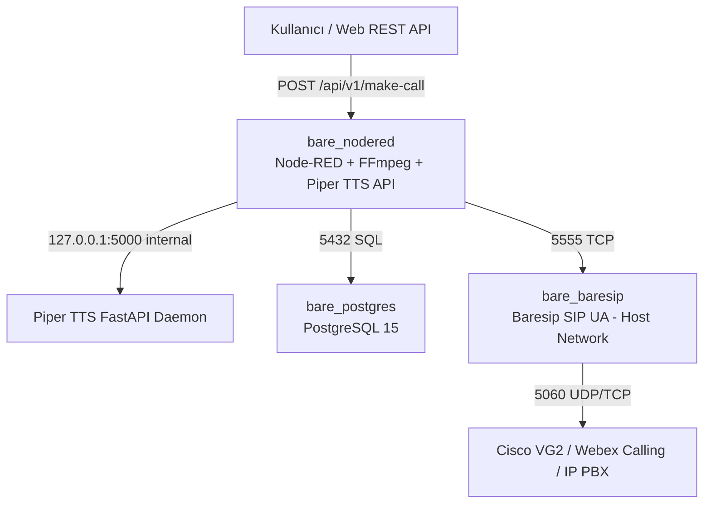

# Node_Red_BareSIP_Stack: Proje Mimarisi, Öğrenimler ve Hata Çözüm Kataloğu

Bu doküman, Node-RED, Baresip SIP UA, Piper TTS ve PostgreSQL bileşenlerinden oluşan telekomünikasyon IVR mimarisinin kurulum adımlarını, karşılaşılan teknik zorlukları (gotchas) ve uygulanan doğrulanmış çözümleri içermektedir.

---

## 🚀 Proje Mimarisi Özeti

---

## 🛠️ Kritik Teknik Öğrenimler ve Çözüm Kataloğu

### 1. 🛡️ Ön Ses Doğrulama Kalkanı (Audio File Existence Guard)
- **Problem:** TTS veya FFmpeg aşamasında bir aksaklık yaşandığında ses dosyası oluşturulamazsa Baresip karşı tarafı arıyor, telefon açıldığında ses bulamadığı için aramayı anında sonlandırıyordu (`session closed: No such file or directory`).
- **Çözüm:** Python arama düğümlerine `os.path.exists(audio_path)` ve `os.path.getsize(audio_path) > 100` kontrolü eklendi. Ses dosyası yoksa SIP araması **kesinlikle engellenir**, `node.error()` ile kırmızı uyarı basılır ve DB'ye `FAILED_AUDIO_MISSING` yazılır.

### 2. ☎️ SIP Account Görünen Adı (Display Name) Yapılandırması
- **Problem:** `config/baresip/accounts` içinde kullanıcı adı olarak string yazıldığında (`<sip:Gadget_IVR@192.168.91.122>`) Cisco Gateway numarayı tanıyamadığı için arama düşüyordu.
- **Çözüm:** Standart SIP AOR formatı uygulandı:
  `"Gadget_IVR" <sip:6666@192.168.91.122>;regint=0;audio_codecs=PCMA,PCMU`
  Böylece Cisco santraline dahili numara `6666` olarak doğru giderken, aranan kişinin telefon ekranında **"Gadget_IVR"** metni gösterildi.

### 3. 🌐 Baresip Docker Host Network Mode (`network_mode: host`)
- **Problem:** Baresip Docker bridge ağında (`172.18.0.2`) çalıştığında SIP `Via:` başlığına container IP'sini basıyordu. Cisco VG2 santrali `incoming uri via 101` eşleşmesini sağlayamayıp aramayı reddediyordu.
- **Çözüm:** `docker-compose.yml` üzerinde `bare_baresip` servisi `network_mode: host` moduna geçirildi. Node-RED konteyneri Baresip'e `extra_hosts: ["baresip:host-gateway"]` ile bağlandı.

### 4. 🔊 Dinamik Ses Yönlendirmesi (`/ausrc aufile,<path>`)
- **Problem:** Baresip başlangıçta `audio_source aufile` olarak dosya belirtilmeden başlatıldığında, arama yanıtlandığında boş dosya adı (`''`) açmaya çalışıp aramayı kapatıyordu.
- **Çözüm:** `config/baresip/config` içine varsayılan ses yolu eklendi ve Python düğümlerinin arama yapmadan önce Baresip'e `/ausrc aufile,<path>` emri göndermesi sağlandı.

### 5. 🎹 DTMF Tuşlama Çift Olay Süzgeci
- **Problem:** Telefonda 1 tuşuna basıldığında Baresip TCP dinleyicisine hem tuşa basılma (`CALL_DTMF_START`) hem de tuştan el çekilme (`CALL_DTMF_END`) olayları yayınlanıyordu.
- **Çözüm:** Python DTMF parser düğümünde sadece `CALL_DTMF_START` ve `key != ''` olayları süzülerek çift tetikleme önlendi.
