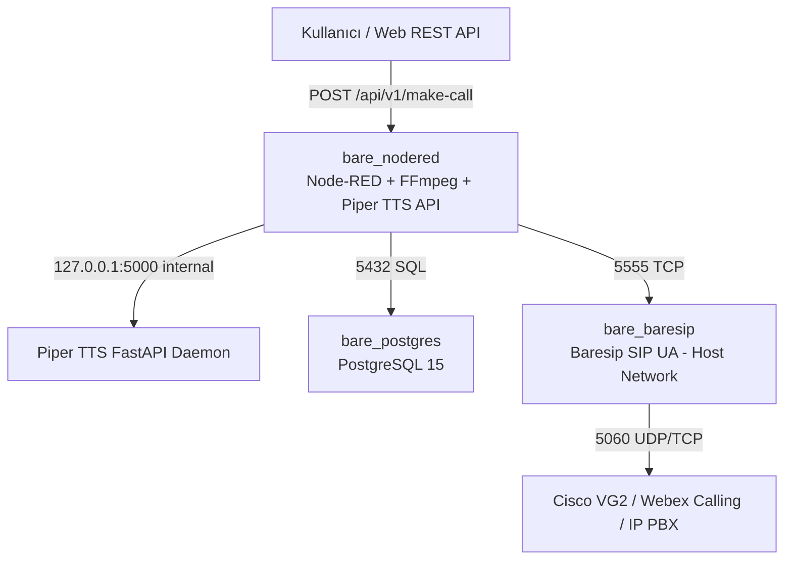

# Node-RED & Baresip IVR Stack: Mimari, Deneyimler ve Teknik Özet

Bu doküman; **Node-RED**, **Piper TTS (Nöral Ses Sentezleme)**, **FFmpeg (Telekom Ses Formatlama)**, **Baresip (SIP Engine)** ve **PostgreSQL** bileşenlerini içeren cross-platform IVR platformunun geliştirilme sürecini, mimari kararlarını ve edinilen tüm rafine teknik tecrübeleri içermektedir.

---

## 1. 📌 Proje Amacı ve Genel Bakış

Projenin temel amacı; yüksek performanslı, ölçeklenebilir ve **saf Python (Python 3)** mantığıyla orkestre edilen otomatik arama, veritabanı kayıtlı IVR (Interactive Voice Response) sistemi oluşturmaktır.

### Temel Yetenekler:
1. **Nöral TTS (Piper):** Türkçe (**Eren** - `tr_TR-eren-medium`) ve İngilizce (**Amy** - `en_US-amy-medium`) ses modelleri ile yüksek kaliteli metinden sese dönüştürme.
2. **Telekom Ses Formatlama (FFmpeg):** Piper çıktısı olan 22050Hz seslerin telekom/SIP hatlarıyla %100 uyumlu **8000Hz, Mono, 16-bit PCM (`pcm_s16le`)** formatına dönüştürülmesi.
3. **SIP Arama Engine (Baresip):** `ctrl_tcp` (Port 5555) üzerinden komuta edilen, numara arama, ses yayınlama ve DTMF (tuşlama) algılama altyapısı.
4. **PostgreSQL DB Entegrasyonu:** `psycopg2-binary` ve `node-red-contrib-postgresql` ile arama kuyruğu (`call_queue`), CDR kayıtları (`call_records`) okuma ve yazma.
5. **Master IVR HTTP API (Tümleşik Pipeline):** Dışarıdan gelen HTTP isteğiyle metni sese dönüştüren, formatlayan, arayan, canlı DTMF dinleyen ve tüm süreci zaman damgasıyla DB'ye kaydeden uçtan uca mimari.

---

## 2. 🏗️ Mimari Evrim ve Alınan Kararlar



1. **`bare_nodered` (Birleşik Node-RED & TTS & FFmpeg):**
   - **Base Image:** `python:3.10-slim` (Debian Bookworm)
   - Node-RED (Port: `1880`) + Piper TTS FastAPI Daemon (Port: `5000` internal, `5005` external) + FFmpeg 7.x + `psycopg2-binary` + `node-red-contrib-postgresql`.
2. **`bare_baresip` (SIP Motoru):**
   - Debian Bookworm tabanlı Baresip SIP UA (`network_mode: host`, Control: `5555` TCP).
3. **`bare_postgres` (Veritabanı):**
   - PostgreSQL 15 Alpine (Port: `5432`, `init.sql` ile otomatik `call_queue` ve `call_records` şema kurulumu).

---

## 3. 💡 Edinilen Kritik Teknik Deneyimler & "Gotchas"

### 1. `python:3.10-slim` (Debian/glibc) vs Alpine (`musl`) Seçimi
- **Deneyim:** C/C++ bağımlılığı olan Python paketleri (`onnxruntime`, `piper-phonemize`, `psycopg2-binary`) Alpine Linux (`musl` libc) üzerinde derleme sorunları yaşatır.
- **Çözüm:** Taban imaj olarak `python:3.10-slim` (Debian Bookworm / `glibc`) kullanılarak hazır `manylinux` wheel paketleriyle derleme süresi 5 saniyeye düşürülmüştür.

### 2. Baresip `network_mode: host` ve Cisco Dial-Peer `Via:` Eşleşmesi
- **Deneyim:** Baresip Docker köprü ağında çalışırken SIP `Via:` başlığına iç IP basıyor ve Cisco VG2 `incoming uri via 101` kuralı eşleşmediği için `dial-peer 0`'a düşüyordu.
- **Çözüm:** `docker-compose.yml` içinde Baresip `network_mode: host` yapıldı. `Via:` IP'si `192.168.85.3` olarak gitti ve `dial-peer 102` eşleşti.

### 3. Node-RED Exec Düğümü Çıkış Bacakları ve Paralel Çağrı Önleme
- **Deneyim:** Exec düğümünün 3 çıktı bacağının tümü bağlı olduğunda aynı an 3 paralel arama emri tetikleniyordu.
- **Çözüm:** Sadece `stdout` (1. bacak) bağlandı.

### 4. Çağrı Cevaplandığında Kapanma Hatası ve `aufile` Ses Akışı
- **Deneyim:** Arama yanıtlandığında Baresip `start_source failed (null.null)` hatası verip `BYE` gönderiyordu.
- **Çözüm:** `config/baresip/config` içerisinde `audio_source aufile,/tmp/media/flow3_telecom.wav` ayarlandı.

### 5. DTMF Çift Mesaj Filtreleme (CALL_DTMF_START vs END)
- **Deneyim:** Tuşa 1 kez basıldığında Baresip hem `CALL_DTMF_START` (tuş basıldı) hem de `CALL_DTMF_END` (tuş bırakıldı, parametre boş) olaylarını yayınlıyordu.
- **Çözüm:** Python süzgecinde sadece `CALL_DTMF_START` ve `key != ""` filtresi uygulanarak tek ve temiz mesaj eldesi sağlandı.

---

## 4. 🚀 Master IVR HTTP API Kullanımı (Adım 5 / Tutorial Flow)

Sisteme dışarıdan REST API isteği atarak arama başlatmak ve sonucu DB'ye kaydetmek için:

**Endpoint:** `POST http://192.168.85.3:1880/api/v1/make-call`  
**Headers:** `Content-Type: application/json`

**Örnek JSON Body:**
```json
{
  "phone_number": "sip:399@192.168.91.122",
  "text": "Merhaba! Bu Master IVR test aramasıdır. Lütfen bir tuşa basınız."
}
```

**Sistemin Çalışma Adımları:**
1. Metin Piper TTS ile üretilir.
2. FFmpeg ile 8kHz Mono PCM telekom formatına çevrilir.
3. PostgreSQL `call_records` tablosuna `IN_PROGRESS` araması yazılır.
4. Baresip üzerinden arama başlatılır ve ses dinletilir.
5. Kullanıcı tuşa bastığında DTMF tuşlaması zaman damgasıyla DB'de güncellenir.
